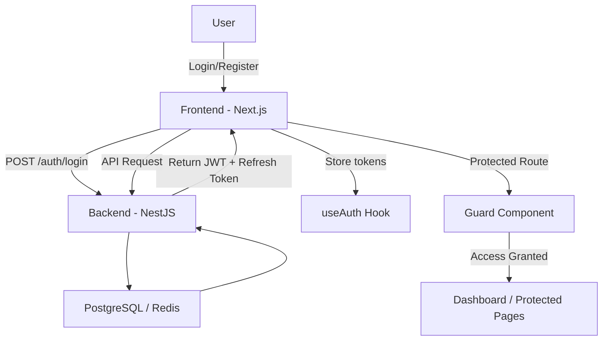
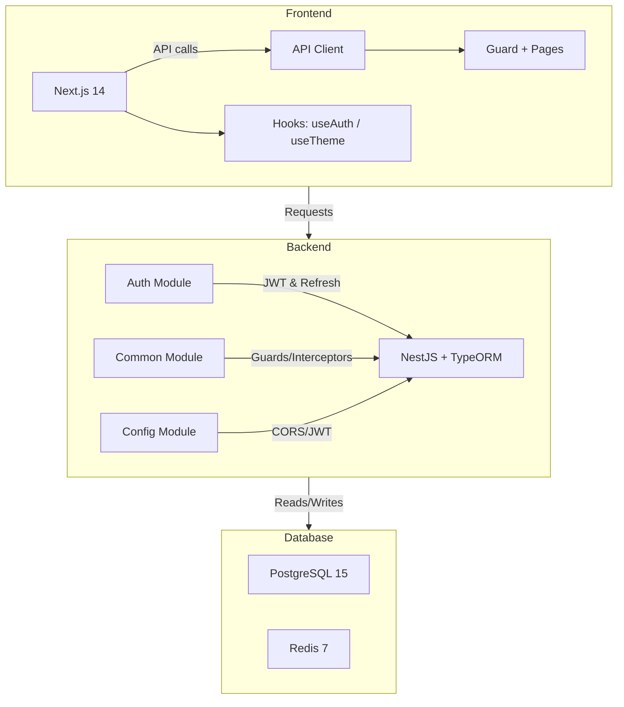

---

# 🟢 DataHub Personal – Portfolio + AI Knowledge Platform

<p align="left">
  <a href="https://nextjs.org/">
    
  </a>
  <a href="https://nestjs.com/">
    
  </a>
  <a href="https://www.typescriptlang.org/">
    
  </a>
  <a href="https://tailwindcss.com/">
    
  </a>
  <a href="https://www.postgresql.org/">
    
  </a>
  <a href="https://redis.io/">
    
  </a>
  <a href="https://www.docker.com/">
    
  </a>
</p>

---

## 📌 Description

DataHub is a **full-stack portfolio + AI knowledge platform** that demonstrates:

* Functional login/logout with JWT & refresh tokens
* Protected frontend routes
* Responsive UI with **dark mode toggle**
* Session management via `useAuth` hook
* API wrapper (`api.ts`) handling refresh tokens

> ⚠️ Advanced security (roles, httpOnly cookies, 2FA) is **not yet implemented**, but this is the **final functional version**.

---

## 🗂️ Project Structure

```text
datahub-platform/
├── backend/
│   ├── src/
│   │   ├── auth/                # Login/Logout, refresh token, JWT
│   │   ├── common/              # Guards, filters, interceptors
│   │   ├── config/              # JWT, CORS
│   │   └── main.ts
│   ├── Dockerfile
│   └── package.json
├── frontend/
│   ├── src/
│   │   ├── components/          # Navbar, Footer, Guard
│   │   ├── hooks/               # useAuth, useTheme
│   │   ├── lib/                 # api.ts, csrf.ts, seo.ts
│   │   └── pages/               # login, register, dashboard
│   ├── Dockerfile
│   └── package.json
├── docker-compose.yml
├── .env.example
└── README.md
```

---

## ⚙️ Implemented Features

### Backend (NestJS + TypeORM)

* ✅ Login & logout endpoints
* ✅ Refresh token endpoint (`/auth/refresh`)
* ✅ JWT-based route protection
* ✅ Basic validation with `ValidationPipe`
* ✅ JSON structured logs

### Frontend (Next.js 14 + Tailwind CSS)

* ✅ Login/logout functionality
* ✅ Session state management with `useAuth`
* ✅ Protected routes using `Guard`
* ✅ Dark mode toggle with `useTheme`
* ✅ API wrapper handling token refresh
* ✅ Responsive pages

---

## 🔄 User Flow Diagram



---

## 🏗️ Architecture Diagram



> This diagram shows **frontend, backend, database, Redis, and internal modules**, illustrating the full architecture.

---

## 💻 How to Run

### Requirements

* Docker 20+ / Docker Compose 2+
* Node.js 18+

### Start Services

```bash
docker compose up -d
```

### Quick Access

* Frontend: [http://localhost:3000](http://localhost:3000)
* Backend: [http://localhost:3001](http://localhost:3001)
* PostgreSQL: port `5432`
* Redis: port `6379`

---

## 🔧 Technologies Used

| Frontend     | Backend          | Database      | DevOps                  |
| ------------ | ---------------- | ------------- | ----------------------- |
| Next.js 14   | NestJS           | PostgreSQL 15 | Docker + Docker Compose |
| TypeScript   | TypeORM          | Redis 7       | ESLint + Prettier       |
| Tailwind CSS | JWT              |               | GitHub Actions          |
| React Hooks  | Class Validators |               |                         |

---

## 🔑 Notes

* Project is **final as-is**, ready for deployment.
* Core features: login/logout, protected pages, dark mode ✅
* Advanced security features not included ⚠️

---

## 📸 Visual Preview


---

